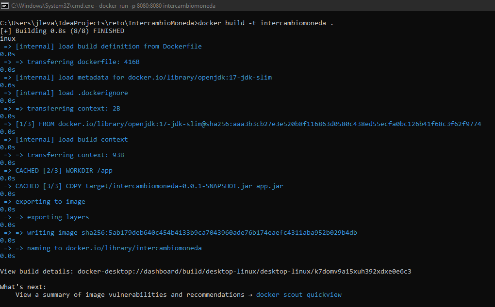
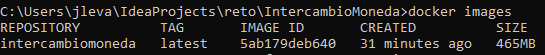
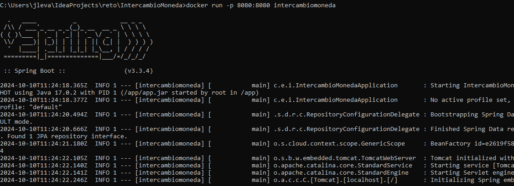
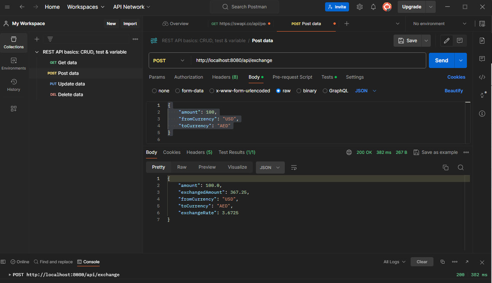
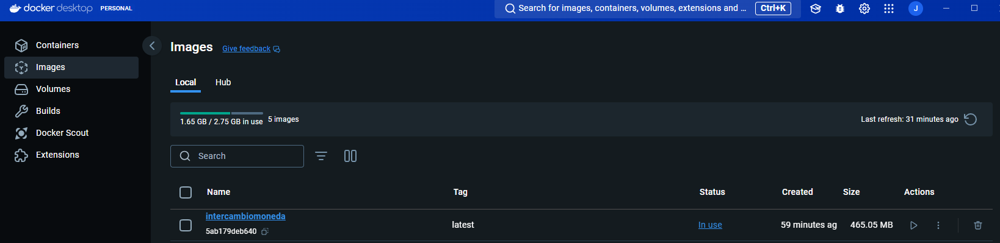

# **Reto**

## Intercambio de moneda:

- **Construir la imagen Docker**
```bash
  docker build -t intercambioMoneda .
```



- **Verificar la Imagen**
```bash
  docker images
```



- **Ejecutar Docker**
```bash
  docker run -p 8080:8080 intercambiomoneda
```


## Consulta Post:




## Imagen en Docker:
